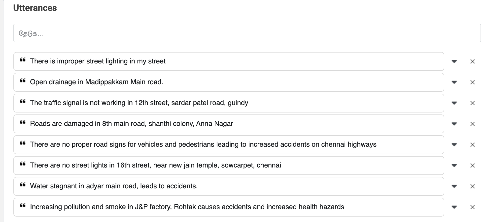

# Sample Response

APP: `https://wit.ai/apps/1188943538251799/`

_Input:_

There is improper street lighting in my street

_Response:_
```json
{"text":"There is improper street lighting in my street","intents":[{"id":"290515959082259","name":"complaintOn","confidence":1}],"entities":{"wit$location:location":[{"id":"569902864150260","name":"wit$location","role":"location","start":37,"end":46,"body":"my street","confidence":0.9335,"entities":[],"suggested":true,"value":"my street","type":"value"}],"ComplaintOn:ComplaintOn":[{"id":"567667434382088","name":"ComplaintOn","role":"ComplaintOn","start":18,"end":33,"body":"street lighting","confidence":0.968,"entities":[],"value":"street lighting","type":"value"}]},"traits":{}}%  
```

##### Conversation 1

